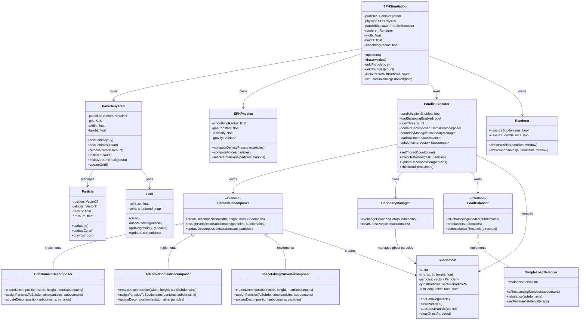

```mermaid
classDiagram
    class SPHSimulation {
        -particles: ParticleSystem
        -physics: SPHPhysics
        -parallelExecutor: ParallelExecutor
        -renderer: Renderer
        -width: float
        -height: float
        -smoothingRadius: float
        +update(dt)
        +draw(window)
        +addParticle(x, y)
        +addParticles(count)
        +initializeDefaultParticles(count)
        +setLoadBalancingEnabled(bool)
    }
    
    class ParticleSystem {
        -particles: vector~Particle*~
        -grid: Grid
        -width: float
        -height: float
        +addParticle(x, y)
        +addParticles(count)
        +removeParticles(count)
        +initialize(count)
        +initializeDamBreak(count)
        +updateGrid()
    }
    
    class SPHPhysics {
        -smoothingRadius: float
        -gasConstant: float
        -viscosity: float
        -gravity: Vector2f
        +computeDensityPressure(particles)
        +computeForces(particles)
        +resolveCollisions(particles, bounds)
    }
    
    class ParallelExecutor {
        -parallelizationEnabled: bool
        -loadBalancingEnabled: bool
        -numThreads: int
        -domainDecomposer: DomainDecomposer
        -boundaryManager: BoundaryManager
        -loadBalancer: LoadBalancer
        -subdomains: vector~Subdomain~
        +setThreadCount(count)
        +executeParallel(task, particles)
        +updateDecomposition(particles)
        +checkAndRebalance()
    }
    
    class Renderer {
        -visualizeSubdomains: bool
        -visualizeLoadBalance: bool
        +drawParticles(particles, window)
        +drawSubdomains(subdomains, window)
    }
    
    class DomainDecomposer {
        <<interface>>
        +createDecomposition(width, height, numSubdomains)
        +assignParticlesToSubdomains(particles, subdomains)
        +updateDecomposition(subdomains, particles)
    }
    
    class GridDomainDecomposer {
        +createDecomposition(width, height, numSubdomains)
        +assignParticlesToSubdomains(particles, subdomains)
        +updateDecomposition(subdomains, particles)
    }
    
    class AdaptiveDomainDecomposer {
        +createDecomposition(width, height, numSubdomains)
        +assignParticlesToSubdomains(particles, subdomains)
        +updateDecomposition(subdomains, particles)
    }
    
    class SpaceFillingCurveDecomposer {
        +createDecomposition(width, height, numSubdomains)
        +assignParticlesToSubdomains(particles, subdomains)
        +updateDecomposition(subdomains, particles)
    }
    
    class BoundaryManager {
        +exchangeBoundaryData(subdomains)
        +clearGhostParticles(subdomains)
    }
    
    class LoadBalancer {
        <<interface>>
        +isRebalancingNeeded(subdomains)
        +rebalance(subdomains)
        +setImbalanceThreshold(threshold)
    }
    
    class SimpleLoadBalancer {
        -rebalanceInterval: int
        +isRebalancingNeeded(subdomains)
        +rebalance(subdomains)
        +setRebalanceInterval(steps)
    }
    
    class Subdomain {
        -id: int
        -x, y, width, height: float
        -particles: vector~Particle*~
        -ghostParticles: vector~Particle*~
        -lastComputationTime: float
        +addParticle(particle)
        +clearParticles()
        +addGhostParticle(particle)
        +clearGhostParticles()
    }
    
    class Particle {
        -position: Vector2f
        -velocity: Vector2f
        -density: float
        -pressure: float
        +update(dt)
        +updateColor()
        +draw(window)
    }
    
    class Grid {
        -cellSize: float
        -cells: unordered_map
        +clear()
        +insertParticle(particle)
        +getNeighbors(x, y, radius)
        +updateGrid(particles)
    }
    
    SPHSimulation --> ParticleSystem : owns
    SPHSimulation --> SPHPhysics : owns
    SPHSimulation --> ParallelExecutor : owns
    SPHSimulation --> Renderer : owns
    
    ParticleSystem --> Particle : manages
    ParticleSystem --> Grid : uses
    
    ParallelExecutor --> DomainDecomposer : owns
    ParallelExecutor --> BoundaryManager : owns
    ParallelExecutor --> LoadBalancer : owns
    ParallelExecutor --> Subdomain : manages
    
    DomainDecomposer <|-- GridDomainDecomposer : implements
    DomainDecomposer <|-- AdaptiveDomainDecomposer : implements
    DomainDecomposer <|-- SpaceFillingCurveDecomposer : implements
    
    LoadBalancer <|-- SimpleLoadBalancer : implements
    
    BoundaryManager --> Subdomain : manages ghost particles
    DomainDecomposer --> Subdomain : creates
```